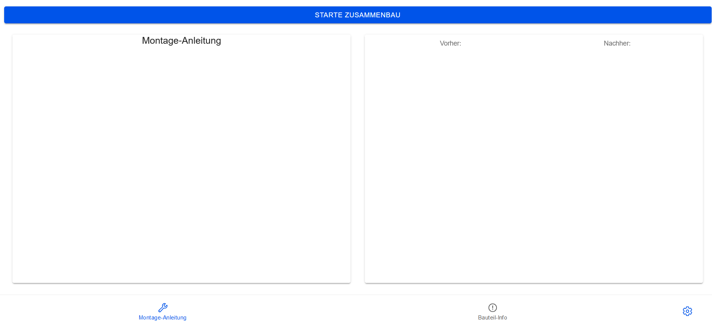
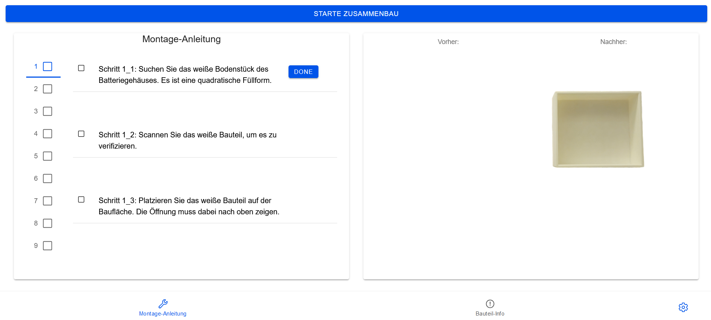

Project created by using https://ionicframework.com/

Requirements to run:
1. Install frameworks by: 
```npm install```
2. Run this application on browser by:
```ionic serve```
in the root directoy.


To deploy application on android device (https://ionicframework.com/docs/angular/your-first-app/deploying-mobile):
1. Build the application by:
```ionic build```
2. Add android platform by:
```ionic cap add android```
3. Sync changes to www folder by: 
```ionic cap sync```
4. Open android studio to deploy to device by:
```ionic cap open android```

To deploy application on ios device (https://ionicframework.com/docs/angular/your-first-app/deploying-mobile):
1. Build the application by:
```ionic build```
2. Add android platform by:
```ionic cap add ios```
3. Sync changes to www folder by: 
```ionic cap sync```
4. Open Xcode studio to deploy to device by:
```ionic cap open ios```

Landing Page:


Start assembly instructions:


Product information page: 
