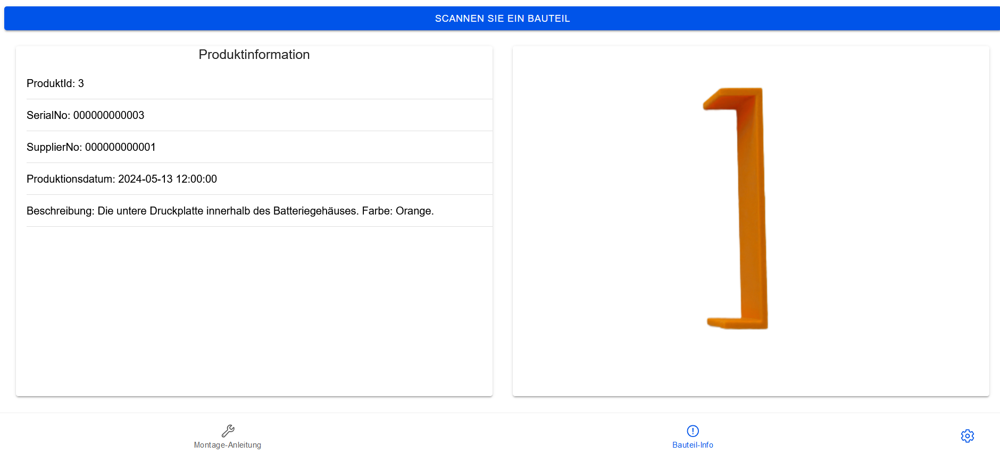

Project created by using https://ionicframework.com/<br />

Requirements to run:<br />
1. Install frameworks by:<br />
```npm install```
2. Run this application on browser by:<br />
```ionic serve```
in the root directoy.<br />

To deploy application on android device (https://ionicframework.com/docs/angular/your-first-app/deploying-mobile):<br />
1. Build the application by:<br />
```ionic build```
2. Add android platform by:<br />
```ionic cap add android```
3. Sync changes to www folder by:<br />
```ionic cap sync```
4. Open android studio to deploy to device by:<br />
```ionic cap open android```
5. Add permissions to android manifest by:<br />
```<uses-permission android:name="android.permission.INTERNET" />
    <uses-permission android:name="android.permission.CAMERA" />
    <uses-permission android:name="android.permission.FLASHLIGHT"/>
    <meta-data android:name="com.google.mlkit.vision.DEPENDENCIES" android:value="barcode_ui"/>
```

To deploy application on ios device (https://ionicframework.com/docs/angular/your-first-app/deploying-mobile):
1. Build the application by:
```ionic build```
2. Add android platform by:
```ionic cap add ios```
3. Sync changes to www folder by: 
```ionic cap sync```
4. Open Xcode studio to deploy to device by:
```ionic cap open ios```

The application supports multiple languages, to add another language:
1. Go to ```src/assets/i18n``` and copy one of the json files.
2. Name the file after the abbreviation of the new language's name.
3. Go into the file and replace all the strings with their translations.

When adding new strings that are displayed in the application use these strings and the
ngx-translate/core module accordingly like in the rest of the application.

Landing Page:


Start assembly instructions:


Product information page: 


To add or change existing workflowsteps go to [this file](https://github.com/Cedde97/worker_assistance_battery/blob/master/src/app/models/ProductWorkflow.ts)
